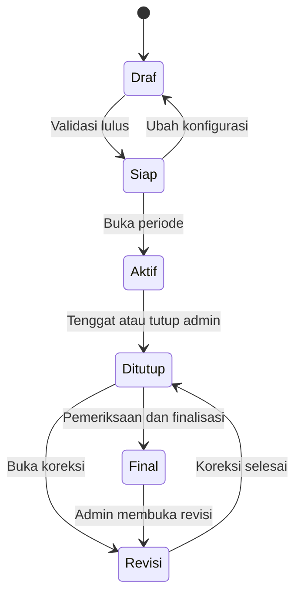
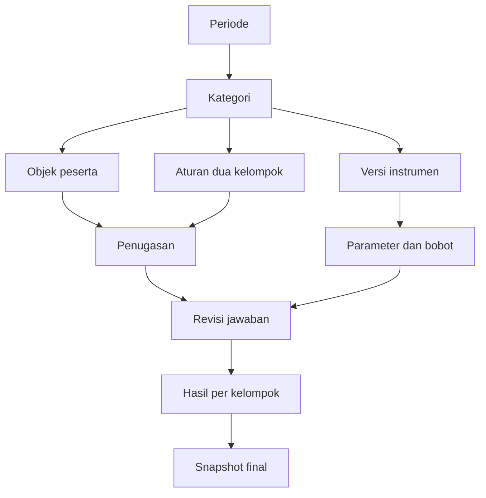

# Requirements End-to-End Web Survei Penilaian FSM UNDIP

**Versi:** 1.0 — konsolidasi kebutuhan dan penyempurnaan yang disetujui  
**Tanggal dokumen:** 9 September 2026  
**Bahasa aplikasi:** Bahasa Indonesia  
**Pemilik kebutuhan:** Fakultas Sains dan Matematika Universitas Diponegoro  
**Jenis dokumen:** Product Requirements Document dan Software Requirements Specification  
**Tujuan penggunaan:** acuan desain, pengembangan, pengujian, demonstrasi, dan penerimaan sistem.

> Dokumen ini merinci kesepakatan percakapan menjadi spesifikasi yang dapat diimplementasikan. Ketentuan bisnis yang telah disepakati merupakan baseline. Detail yang belum dibahas secara eksplisit diberi label **default implementasi** atau **target teknis usulan**; keduanya bukan klaim bahwa pengguna telah memilih detail tersebut. Sistem tidak harus dibangun dengan framework atau penyedia tertentu.

## Daftar isi

1. [Ringkasan produk](#1-ringkasan-produk)
2. [Status keputusan dan batas lingkup](#2-status-keputusan-dan-batas-lingkup)
3. [Istilah dan konsep inti](#3-istilah-dan-konsep-inti)
4. [Aktor dan matriks hak akses](#4-aktor-dan-matriks-hak-akses)
5. [Hierarki organisasi dan identitas](#5-hierarki-organisasi-dan-identitas)
6. [Login dan sesi](#6-login-dan-sesi)
7. [Periode dan siklus hidup](#7-periode-dan-siklus-hidup)
8. [Kategori dan objek penilaian](#8-kategori-dan-objek-penilaian)
9. [Instrumen dan versi](#9-instrumen-dan-versi)
10. [Konfigurasi dan pembagian penilai](#10-konfigurasi-dan-pembagian-penilai)
11. [Formulir dan siklus jawaban](#11-formulir-dan-siklus-jawaban)
12. [Perhitungan lengkap](#12-perhitungan-lengkap)
13. [Hasil dan leaderboard](#13-hasil-dan-leaderboard)
14. [Finalisasi dan revisi](#14-finalisasi-dan-revisi)
15. [Impor dan ekspor](#15-impor-dan-ekspor)
16. [Halaman dan interaksi](#16-halaman-dan-interaksi)
17. [Use case end-to-end](#17-use-case-end-to-end)
18. [Model data konseptual](#18-model-data-konseptual)
19. [Kontrak layanan dan transaksi](#19-kontrak-layanan-dan-transaksi)
20. [Validasi dan kondisi khusus](#20-validasi-dan-kondisi-khusus)
21. [Audit dan operasional](#21-audit-dan-operasional)
22. [Kebutuhan nonfungsional](#22-kebutuhan-nonfungsional)
23. [Data dummy dan skenario demo](#23-data-dummy-dan-skenario-demo)
24. [Kriteria penerimaan dan pengujian](#24-kriteria-penerimaan-dan-pengujian)
25. [Tahapan implementasi dan Definition of Done](#25-tahapan-implementasi-dan-definition-of-done)
26. [Register default dan keputusan lanjutan](#26-register-default-dan-keputusan-lanjutan)
27. [Matriks keterlacakan](#27-matriks-keterlacakan)

## 1. Ringkasan produk

### 1.1 Masalah yang diselesaikan

FSM membutuhkan aplikasi untuk menyusun penilaian berbagai kategori tanpa membuat formulir atau perhitungan baru secara manual setiap kali kegiatan berubah. Penilai perlu menerima tugas secara terarah, skor perlu dihitung konsisten, dan akses hasil perlu mengikuti struktur organisasi.

Aplikasi harus menghubungkan seluruh proses: data organisasi → kategori dan instrumen → objek → penugasan → pengisian → hasil sementara → pemeriksaan → hasil final → arsip.

### 1.2 Hasil yang diharapkan

- Admin membuat kategori, jenis objek, parameter, indikator, bobot, skala, dan metode agregasi melalui antarmuka.
- Admin menentukan siapa yang dinilai dan siapa yang mengisi penilaian.
- Sistem membagikan tugas penilai acak sesuai aturan dan berusaha meratakan beban.
- Pimpinan mendapatkan formulir penilaian, bukan hanya dashboard pemantauan.
- Hasil pimpinan dan selain pimpinan dihitung serta diranking terpisah.
- Pimpinan dapat menelusuri hasil hingga identitas dan jawaban penilai untuk objek dalam unit dan turunannya.
- Admin memiliki akses penuh; semua koreksi penting memiliki riwayat.
- Setiap periode dapat ditelusuri kembali tanpa berubah diam-diam akibat perubahan organisasi atau instrumen.

### 1.3 Indikator keberhasilan produk

| ID      | Indikator penerimaan                                                              |
| ------- | --------------------------------------------------------------------------------- |
| GOAL-01 | Kategori baru dapat dibuat tanpa perubahan kode.                                  |
| GOAL-02 | Tidak ada tugas penilaian diri sendiri atau tugas ganda yang melanggar aturan.    |
| GOAL-03 | Nilai akhir dapat direproduksi dari jawaban dan versi aturan yang tersimpan.      |
| GOAL-04 | Dua leaderboard tidak saling mencampur nilai.                                     |
| GOAL-05 | Hasil unit di luar cakupan tidak dapat diakses pimpinan.                          |
| GOAL-06 | Jawaban terkirim terkunci; koreksi admin dapat ditelusuri.                        |
| GOAL-07 | Seluruh alur dari pembuatan periode hingga finalisasi berjalan dengan data dummy. |

## 2. Status keputusan dan batas lingkup

### 2.1 Baseline yang telah disepakati

1. Aplikasi dinamis melalui pengaturan admin.
2. Sasaran meliputi orang, unit, karya, dan jenis lain.
3. Hierarki organisasi dinamis; satu unit memiliki satu atau lebih pimpinan.
4. Satu akun admin memiliki akses seluruh fakultas.
5. Dekan adalah pimpinan tertinggi di tingkat fakultas.
6. Pimpinan melihat unit sendiri dan unit di bawahnya saja.
7. Pimpinan dapat melihat identitas penilai, jawaban, rincian skor, dan leaderboard pada cakupan tersebut.
8. Admin atau Dekan mengatur waktu akses hasil bagi pimpinan.
9. Ada penilaian pimpinan dan selain pimpinan dengan instrumen sama dan hasil terpisah.
10. Pimpinan mengisi untuk peserta/objek satu unit sesuai penugasan; tidak otomatis menilai seluruh subunit.
11. Staf dapat menilai pimpinannya dalam satu unit sesuai tugas.
12. Pengacakan, jenis penilai, lingkup, jumlah, serta penanganan kekurangan diatur admin.
13. Default jumlah penilai acak 10; tidak boleh menilai diri sendiri.
14. Seluruh parameter wajib terisi saat pengiriman; tidak tersedia jawaban tidak dapat menilai.
15. Draf diperbolehkan, tetapi tidak masuk perhitungan.
16. Jawaban langsung terkunci setelah dikirim; admin dapat mengubah atau membukanya kembali dengan jejak perubahan.
17. Default agregasi rata-rata; pilihan total tersedia. Kontribusi bobot dihitung terhadap skor gabungan.
18. Minimum respons, aturan nilai sama, revisi, dan finalisasi diterapkan sesuai penyempurnaan.
19. Login pertama sederhana menggunakan identitas manual dan data dummy; SSO/OAuth ditunda.
20. Riwayat, impor Excel, ekspor sesuai akses, dan pelaporan masalah penugasan termasuk kebutuhan.

### 2.2 Referensi instrumen

Lampiran `Instrumen_Penilaian_Dies_FSM_UNDIP_2026_9_Slide_Repaired.pdf` menjadi referensi konsep parameter, indikator, bobot, dan skor. Sembilan kategori di dalamnya tidak wajib menjadi kategori tetap. Usulan komposisi atasan 60% dan sejawat 40% dalam PDF tidak digunakan untuk menggabungkan dua leaderboard karena keputusan pengguna adalah memisahkannya.

### 2.3 Lingkup versi awal

Seluruh alur inti, hierarki, pengaturan instrumen, penugasan, formulir, dua hasil, kontrol akses, revisi, impor/ekspor, serta arsip periode harus dapat didemonstrasikan. Data dummy dan autentikasi prototipe digunakan pada tahap ini. Penyimpanan aplikasi harus mempertahankan data lintas halaman dan sesi demonstrasi; tidak cukup berupa tampilan statis.

### 2.4 Di luar lingkup awal

- Integrasi OAuth/SSO FSM UNDIP dan migrasi akun produksi.
- Email, WhatsApp, SMS, atau pengingat eksternal.
- Editor rumus bebas, kode formula buatan pengguna, atau eksekusi skrip.
- Penilaian otomatis memakai AI.
- Pengambilan otomatis data publikasi/IKU dari sistem lain.
- Otomatisasi seluruh mekanisme kompetisi PDF, seperti seleksi finalis bertahap.
- Aplikasi mobile native dan pengiriman formulir saat offline.
- Unggah video besar dan transcoding; versi awal dapat menggunakan URL karya.

Tidak ada fitur di luar lingkup yang boleh ditampilkan seolah sudah terintegrasi.

## 3. Istilah dan konsep inti

| Istilah            | Definisi                                                                         |
| ------------------ | -------------------------------------------------------------------------------- |
| Unit               | Simpul organisasi, misalnya fakultas, departemen, prodi, atau unit administrasi. |
| Subunit            | Seluruh keturunan suatu unit, bukan hanya anak langsung.                         |
| Jenis pengguna     | Klasifikasi seperti dosen, tendik, mahasiswa; terpisah dari hak akses.           |
| Pimpinan           | Penetapan jabatan pengguna pada unit tertentu.                                   |
| Objek              | Orang/unit/karya/lainnya yang menerima penilaian.                                |
| Penilai            | Pengguna yang memiliki tugas mengisi skor suatu objek.                           |
| Kelompok penilaian | Pimpinan atau selain pimpinan, melekat pada penugasan.                           |
| Instrumen          | Kumpulan parameter, indikator, skala, bobot, dan panduan.                        |
| Skor               | Angka input pada satu parameter dari seorang penilai.                            |
| Agregasi           | Rata-rata atau total skor antarpenilai dalam kelompok yang sama.                 |
| Nilai bobot        | Skor gabungan dikali bobot persentase, dibagi 100.                               |
| Respons berlaku    | Revisi jawaban terkirim terakhir yang masih sah pada tugas aktif.                |
| Snapshot           | Rekaman data/aturan pada titik waktu tertentu untuk pelacakan historis.          |
| Finalisasi         | Penetapan hasil resmi dengan versi yang dapat ditelusuri.                        |
| Pembukaan revisi   | Proses mengubah data setelah ditutup/final dengan alasan dan versi baru.         |

**Pembedaan wajib:** pemilik objek menentukan lingkup hasil; identitas penilai menentukan pelaku pengisian; kelompok pada tugas menentukan tempat perhitungan. Ketiganya tidak boleh disamakan.

## 4. Aktor dan matriks hak akses

### 4.1 Matriks utama

Legenda: **Ya** = diizinkan; **Lingkup** = hanya objek dalam unit yang dipimpin dan turunannya; **Tugas** = hanya penugasan sendiri; **Tidak** = tidak diberikan oleh peran tersebut.

| Aksi                                       | Admin | Dekan    | Pimpinan unit | Pengguna |
| ------------------------------------------ | ----- | -------- | ------------- | -------- |
| Kelola master pengguna/unit/jenis objek    | Ya    | Tidak    | Tidak         | Tidak    |
| Tetapkan pimpinan                          | Ya    | Tidak    | Tidak         | Tidak    |
| Buat kategori, instrumen, periode          | Ya    | Tidak    | Tidak         | Tidak    |
| Atur dan acak penugasan                    | Ya    | Tidak    | Tidak         | Tidak    |
| Isi formulir pribadi                       | Tugas | Tugas    | Tugas         | Tugas    |
| Lihat draf sendiri                         | Tugas | Tugas    | Tugas         | Tugas    |
| Lihat jawaban terkirim sendiri             | Tugas | Tugas    | Tugas         | Tugas    |
| Lihat rekap dan leaderboard                | Ya    | Fakultas | Lingkup       | Tidak    |
| Lihat identitas/jawaban penilai pada hasil | Ya    | Fakultas | Lingkup       | Tidak    |
| Atur waktu akses hasil pimpinan            | Ya    | Ya       | Tidak         | Tidak    |
| Ekspor hasil dan rincian jawaban           | Ya    | Fakultas | Lingkup       | Tidak    |
| Edit/buka kembali/batalkan jawaban         | Ya    | Tidak    | Tidak         | Tidak    |
| Tutup/finalkan/buka revisi periode         | Ya    | Tidak    | Tidak         | Tidak    |
| Lapor masalah penugasan                    | Tugas | Tugas    | Tugas         | Tugas    |
| Tangani masalah penugasan                  | Ya    | Tidak    | Tidak         | Tidak    |
| Lihat audit administratif menyeluruh       | Ya    | Tidak    | Tidak         | Tidak    |

Waktu akses berlaku pada hasil pimpinan, termasuk Dekan, sesuai kebijakan periode. Dekan tetap dapat membuka halaman pengaturan waktu akses. Admin tidak terhalang jadwal akses hasil.

### 4.2 Gabungan peran

- Hak akses merupakan gabungan peran aktif pengguna; status admin tetap memberikan akses penuh.
- Satu pengguna dengan dua jabatan pimpinan mendapatkan gabungan cakupan kedua unit.
- Login tidak boleh menerima peran atau unit yang diklaim sendiri oleh pengguna.
- Akses membaca hasil tidak memberikan hak mengedit jawaban.
- Pimpinan yang merupakan peserta tetap dapat melihat hasil dirinya jika berada dalam cakupan yang diizinkan; tidak ada pengecualian tambahan yang telah diminta.
- **Default implementasi:** draf pengguna tidak termasuk detail hasil yang boleh dibaca pimpinan; hanya status pengerjaannya yang terlihat. Admin tetap dapat menangani data dengan jejak tindakan.

### 4.3 Pengaturan waktu akses

Pilihan: selama aktif, setelah ditutup, setelah final, atau waktu tertentu. Pengaturan disimpan per periode dengan revisi dan pelaku. Default implementasi adalah setelah final. Ketika admin dan Dekan mengubah bersamaan, pembaruan memakai nomor versi; perubahan yang sudah kedaluwarsa ditolak untuk dimuat ulang, bukan menimpa diam-diam.

## 5. Hierarki organisasi dan identitas

### 5.1 Requirements organisasi

| ID     | Requirement                                                                                                         |
| ------ | ------------------------------------------------------------------------------------------------------------------- |
| ORG-01 | Admin dapat membuat, mengubah, menonaktifkan, dan memindahkan unit.                                                 |
| ORG-02 | Setiap unit selain akar memiliki satu induk; siklus dan induk diri sendiri dilarang.                                |
| ORG-03 | Fakultas menjadi akar lingkup aplikasi awal.                                                                        |
| ORG-04 | Unit dapat memiliki nol pimpinan saat draf master, tetapi penugasan pimpinan harus menampilkan kekosongan tersebut. |
| ORG-05 | Satu atau lebih pimpinan dapat ditetapkan dengan masa aktif.                                                        |
| ORG-06 | Penghapusan keras unit yang sudah dipakai periode dilarang; gunakan nonaktif.                                       |
| ORG-07 | Perpindahan unit tidak otomatis memindahkan objek/penugasan dalam periode berjalan.                                 |

### 5.2 Requirements identitas

- ID login disimpan sebagai teks agar nol awal tidak hilang.
- ID harus unik setelah normalisasi spasi tepi; format tidak diasumsikan selalu numerik atau panjang tertentu.
- Nama tidak digunakan sebagai kunci unik.
- Default implementasi: satu unit utama per pengguna; beberapa jabatan kepemimpinan dapat tersimpan terpisah.
- Status nonaktif mencegah login dan penugasan baru.
- Tugas belum selesai milik pengguna nonaktif ditandai perlu tindakan admin, bukan otomatis dianggap selesai.
- Jawaban yang telah sah tetap tersimpan walaupun penilai menjadi nonaktif.
- Data historis menyimpan nama/unit saat penugasan dengan referensi ID master yang stabil.

### 5.3 Riwayat organisasi dan akses

Default implementasi: hasil historis dikelompokkan menggunakan snapshot unit pada periode; pemimpin yang saat ini berwenang terhadap unit tersebut dapat melihat riwayat unit setelah waktu akses terpenuhi. Mantan pimpinan tidak mempertahankan akses hanya karena pernah menjabat. Perubahan pohon unit tidak boleh memberikan akses historis lintas lingkup secara tak terduga; pemetaan reorganisasi ditangani admin dan diaudit.

## 6. Login dan sesi

### 6.1 Prototipe

| ID      | Requirement                                                                     |
| ------- | ------------------------------------------------------------------------------- |
| AUTH-01 | Form meminta ID terdaftar dan memverifikasi akun aktif pada data aplikasi.      |
| AUTH-02 | ID tak terdaftar/tidak aktif tidak dapat masuk.                                 |
| AUTH-03 | Sesi menyimpan identitas pengguna; otorisasi ditentukan aplikasi.               |
| AUTH-04 | Logout mengakhiri sesi dan menghapus data privat dari tampilan/cache sesi.      |
| AUTH-05 | Halaman menunjukkan bahwa lingkungan menggunakan data demo dan login prototipe. |
| AUTH-06 | Tidak ada pendaftaran mandiri yang memberi akses admin/pimpinan.                |

Login ID saja bukan verifikasi kepemilikan identitas. Karena itu lingkungan ini untuk dummy/demo; kebutuhan produksi memerlukan autentikasi sebenarnya sebelum menggunakan jawaban personal nyata.

### 6.2 Sesi dan gangguan

Jika sesi berakhir saat mengisi, aplikasi meminta login kembali tanpa mengklaim pengiriman berhasil. Draf yang telah tersimpan dapat dipulihkan. Permintaan simpan/kirim memeriksa ulang pengguna, kepemilikan tugas, status periode, dan versi jawaban.

### 6.3 Kontrak pengembangan SSO berikutnya

Akun internal memakai ID stabil terpisah dari ID login. Pemetaan SSO nantinya menggunakan identitas penyedia yang terverifikasi; tidak melakukan penggabungan berdasarkan nama. Detail endpoint, protokol, kredensial, dan pemetaan atribut SSO belum ditentukan dan tidak boleh dikarang dalam implementasi demo.

## 7. Periode dan siklus hidup

### 7.1 Data periode

Nama, kode unik, deskripsi, zona waktu, mulai, tenggat, status, kebijakan akses, pembuat, versi, serta tanggal finalisasi. Default zona waktu tampilan: Asia/Jakarta; penyimpanan waktu menggunakan UTC.

### 7.2 State machine



Revisi menyimpan hubungan dengan versi final sebelumnya. Hasil final lama tetap dapat ditelusuri. Jadwal pembukaan otomatis hanya dijalankan jika periode sudah siap; kegagalan validasi dilaporkan kepada admin.

### 7.3 Validasi sebelum siap

- Minimal satu kategori aktif dan objek yang dipilih.
- Instrumen lengkap; bobot valid; skala memiliki minimum, maksimum, dan langkah input.
- Aturan kedua kelompok terdefinisi walaupun salah satu kelompok mungkin tidak punya penilai.
- Daftar penugasan sudah dipreview dan masalah kekurangan ditangani secara eksplisit.
- Minimum respons tidak boleh melebihi target tanpa peringatan yang harus diselesaikan.
- Tanggal mulai lebih awal dari tenggat.
- Objek memiliki unit dan, untuk nonorang, penanggung jawab.
- Pemilik karya yang dikecualikan tidak muncul sebagai penilai.

### 7.4 Batas waktu

Default implementasi: pengiriman diterima jika waktu server lebih kecil daripada tenggat. Saat tepat tenggat atau sesudahnya, pengiriman baru ditolak. Permintaan yang sudah selesai diproses sebelum tenggat tetap sah. Jadwal yang diubah admin tercatat, dan perubahan status tidak bergantung pada jam perangkat pengguna.

### 7.5 Menyalin periode

Default implementasi yang mendukung penggunaan ulang: admin dapat menyalin konfigurasi dan pilihan objek ke draf periode baru. Jawaban, hasil final, serta penugasan lama tidak disalin sebagai data aktif. Calon penilai dievaluasi ulang berdasarkan pengguna aktif.

## 8. Kategori dan objek penilaian

### 8.1 Konfigurasi kategori

Kode, nama, deskripsi, jenis objek, instrumen, metode agregasi per kelompok, target penilai, minimum respons per kelompok, aturan tie-break, serta kebijakan pengecualian. Kategori yang telah dipakai tidak dihapus secara permanen.

Default implementasi: satu jenis objek per kategori, banyak kategori dalam periode. Jenis baru dapat dibuat admin dengan metadata dasar; tidak berarti pembuat formulir data bebas tanpa batas.

### 8.2 Pemilihan peserta

Admin memilih seluruh populasi yang sesuai, filter jenis/unit, atau daftar eksplisit. Sebelum membuka periode, sistem memperlihatkan jumlah dan daftar peserta final. Pemilihan berbasis filter disimpan sebagai aturan dan snapshot; masuknya pengguna baru tidak otomatis menambah peserta ke periode aktif.

### 8.3 Atribut objek

| Jenis   | Atribut wajib                               | Atribut tambahan                |
| ------- | ------------------------------------------- | ------------------------------- |
| Orang   | Pengguna terkait, unit snapshot             | Deskripsi                       |
| Unit    | Unit yang dinilai, penanggung jawab         | Deskripsi                       |
| Karya   | Nama, jenis, unit pemilik, penanggung jawab | URL, deskripsi, anggota pembuat |
| Lainnya | Nama, jenis, unit pemilik, penanggung jawab | Deskripsi dan URL referensi     |

Satu objek muncul paling banyak sekali dalam kategori yang sama pada periode yang sama. Objek yang sama boleh mengikuti kategori lain dengan instrumen dan tugas berbeda.

### 8.4 Penanggung jawab

Menjadi penanggung jawab tidak otomatis memberi akses hasil. Jika admin menonaktifkan pengecualian pembuat karya, sistem menampilkan peringatan konflik keterlibatan dan mencatat pengaturan. Larangan menilai diri sendiri untuk objek orang tetap tidak dapat ditiadakan.

## 9. Instrumen dan versi

### 9.1 Requirements instrumen

| ID     | Requirement                                                                 |
| ------ | --------------------------------------------------------------------------- |
| INS-01 | Admin menambah/mengubah/mengurutkan parameter dan indikator.                |
| INS-02 | Bobot parameter berupa persentase nonnegatif dengan total tepat 100%.       |
| INS-03 | Skala yang sama digunakan seluruh parameter kategori pada versi awal.       |
| INS-04 | Parameter memiliki ID stabil, nama, indikator, bobot, dan urutan.           |
| INS-05 | Form pimpinan dan selain pimpinan merujuk versi instrumen yang sama.        |
| INS-06 | Preview formulir dan simulasi hitung tersedia sebelum aktif.                |
| INS-07 | Validasi server mengulang seluruh aturan input, bukan mengandalkan browser. |
| INS-08 | Versi lama tidak ditimpa setelah digunakan jawaban.                         |

### 9.2 Skala

Default skor 0–100, langkah 1. Admin dapat memilih rentang lain seperti 1–5 dan langkah yang sesuai. Nilai di luar skala, teks, angka non-finit, atau angka yang tidak sesuai langkah ditolak. Bobot nol diperbolehkan secara default untuk parameter informatif tetapi tetap wajib diisi jika dimasukkan dalam instrumen; UI menjelaskan bahwa parameter itu tidak memengaruhi hasil.

### 9.3 Revisi instrumen

| Perubahan                                 | Penanganan default                                                                   |
| ----------------------------------------- | ------------------------------------------------------------------------------------ |
| Salah ketik tanpa perubahan makna         | Revisi redaksi tercatat, jawaban tetap berlaku.                                      |
| Bobot atau metode agregasi                | Preview dampak, versi aturan baru, perhitungan ulang tercatat.                       |
| Parameter baru/dihapus atau skala berubah | Revisi substantif; tentukan pengisian ulang, jangan membuat skor untuk jawaban lama. |
| Makna indikator berubah                   | Perlakukan sebagai revisi substantif.                                                |

Satu leaderboard resmi tidak boleh mencampur skor instrumen yang secara substantif tidak sebanding. Admin harus menyelesaikan migrasi/pengisian ulang atau memisahkan hasil revisi sebelum finalisasi.

## 10. Konfigurasi dan pembagian penilai

### 10.1 Dua tahap

Pertama admin menetapkan aturan dan sistem menyusun preview. Kedua admin menerapkan preview menjadi tugas. Preview memperlihatkan kandidat, beban, kekurangan, pengecualian, dan jumlah tugas yang akan diterbitkan.

### 10.2 Aturan kelayakan

Calon penilai harus aktif, berada dalam lingkup pilihan, memenuhi filter jenis pengguna, bukan orang yang dinilai, tidak dikecualikan karena keterlibatan karya, dan belum memiliki tugas duplikat. Filter diterapkan sebelum pengacakan.

Untuk kelompok pimpinan, calon berasal dari penetapan pimpinan satu unit objek. Admin dapat memilih satu atau lebih dari calon tersebut. Untuk pimpinan yang menjadi objek, dirinya dikeluarkan; pimpinan lain pada unit yang sama dapat dipilih. Jika tidak ada, kelompok pimpinan ditandai tidak memiliki penilai.

### 10.3 Kelompok melekat pada tugas

Setiap tugas menyimpan `assessment_group` dan alasan/aturan pemilihannya. Jabatan penilai tidak boleh ditafsir ulang saat hasil dihitung. Default implementasi: satu penilai tidak menilai objek/kategori yang sama di kedua kelompok sekaligus; bila memenuhi dua jalur, admin memilih satu agar kontribusi tidak dihitung dua kali pada dua perspektif.

### 10.4 Pengacakan merata

Default algoritme:

1. Bentuk calon sah per objek.
2. Proses objek dengan jumlah calon paling terbatas lebih awal.
3. Acak urutan kandidat yang memiliki beban setara.
4. Pilih kandidat dengan beban penugasan paling rendah dalam periode sambil menjaga aturan setiap objek.
5. Hindari duplikasi; tambah beban setiap pilihan.
6. Tampilkan sisa kekurangan dan distribusi beban.

Keseimbangan merupakan upaya terbaik, bukan jaminan semua orang mendapat jumlah sama ketika calon berbeda. Simpan batch, konfigurasi, daftar calon/snapshot, seed atau jejak pemilihan, hasil, dan pembuat untuk reproduksi audit. Tidak perlu menampilkan detail algoritme kepada penilai.

### 10.5 Kekurangan calon

| Pilihan admin    | Efek                                                 |
| ---------------- | ---------------------------------------------------- |
| Semua tersedia   | Terbitkan sesuai jumlah sah; simpan selisih target.  |
| Perluas lingkup  | Admin memilih lingkup baru; preview dihitung ulang.  |
| Pengganti manual | Pilih pengguna yang sah menurut aturan hasil revisi. |

Sistem tidak menurunkan minimum respons secara diam-diam. Bila minimum tidak mungkin tercapai, admin harus mengubah minimum atau menerima bahwa objek belum layak peringkat. Nol calon menghasilkan status jelas, bukan tugas palsu.

### 10.6 Pengacakan ulang dan penggantian

- Tugas terkirim tidak diganti oleh pengacakan ulang.
- Tugas belum dikirim dapat dibatalkan dan diganti, dengan hubungan tugas asal/pengganti.
- Draf pada tugas yang dibatalkan tetap tersimpan sebagai riwayat, tidak dihitung.
- Jika kebutuhan menghapus respons terkirim benar-benar ada, admin membatalkan respons dengan alasan; data historis tidak dihapus.
- Dua batch bersamaan tidak dapat menerbitkan tugas duplikat.

## 11. Formulir dan siklus jawaban

### 11.1 Informasi formulir

Identitas objek, unit, kategori, periode, tenggat, kelompok tugas, petunjuk, parameter, indikator, rentang skor, dan nilai input. Bobot dapat ditampilkan agar perhitungan transparan. Hasil penilai lain tidak ditampilkan dalam formulir.

### 11.2 Status tugas

| Status         | Makna                                                                   |
| -------------- | ----------------------------------------------------------------------- |
| Belum mulai    | Tugas aktif tanpa draf.                                                 |
| Draf           | Sebagian/seluruh skor disimpan, belum dikirim.                          |
| Terkirim       | Respons lengkap dan terkunci.                                           |
| Dibuka kembali | Admin memberikan kesempatan memperbaiki.                                |
| Dibatalkan     | Tidak wajib lagi, tidak dihitung.                                       |
| Lewat tenggat  | Belum dikirim saat pengisian berakhir; status tampilan, bukan skor nol. |

### 11.3 Penyimpanan draf

Draf boleh tidak lengkap. Default implementasi menyediakan tombol Simpan draf dan penanda waktu simpan terakhir. Jika autosave ditambahkan, indikator sukses/gagal harus jelas. Menutup halaman dengan perubahan yang belum tersimpan memunculkan pemberitahuan. Draf yang gagal tersimpan tidak boleh dianggap terkirim.

### 11.4 Pengiriman

Server memverifikasi kepemilikan tugas, akun aktif, periode terbuka atau jendela koreksi sah, instrumen sesuai, seluruh skor lengkap, rentang valid, dan tidak ada revisi konflik. Setelah sukses, simpan respons serta waktu kirim dalam satu transaksi dan tampilkan bukti status terkirim.

Klik ganda, retry jaringan, atau refresh tidak menghasilkan dua respons aktif. Pengiriman memakai pengenal idempotensi atau mekanisme setara.

### 11.5 Pembukaan kembali

Default implementasi: jawaban terkirim lama tetap menjadi respons berlaku sampai revisi baru dikirim, kecuali admin secara eksplisit membatalkannya. Revisi draf tidak mengubah leaderboard. UI memberi label sedang diperbaiki. Setelah revisi dikirim, respons baru menggantikan respons berlaku; keduanya tersimpan dalam audit.

Jika periode ditutup, pembukaan kembali harus menyertakan jendela koreksi yang eksplisit atau membuka status revisi. Tombol membuka tugas saja tidak boleh melewati tenggat secara tersembunyi.

### 11.6 Laporan masalah penugasan

Pengguna memilih tugas, kategori masalah, dan keterangan. Contoh: objek keliru, unit keliru, pengguna nonaktif, atau tautan karya salah. Laporan bukan jawaban survei dan tidak membebaskan kewajiban sebelum admin bertindak. Status: terbuka, ditangani, selesai. Admin dapat mempertahankan tugas dengan penjelasan, memperbaiki data, mengganti penilai, atau membatalkan tugas. Semua tindakan tercatat.

## 12. Perhitungan lengkap

### 12.1 Notasi

- `o`: objek pada kategori/periode.
- `g`: kelompok, `PIMPINAN` atau `SELAIN_PIMPINAN`.
- `p`: parameter.
- `R(o,g)`: kumpulan respons berlaku yang sudah dikirim.
- `n(o,g)`: jumlah respons tersebut.
- `s(r,p)`: skor parameter p dari respons r.
- `w(p)`: bobot persentase parameter p, dengan jumlah w = 100.
- `A(o,g,p)`: skor gabungan parameter.
- `B(o,g,p)`: kontribusi berbobot.
- `F(o,g)`: nilai akhir kelompok.

### 12.2 Rumus

Untuk metode rata-rata:

```text
A(o,g,p) = SUM(s(r,p) untuk r dalam R(o,g)) / n(o,g)
B(o,g,p) = A(o,g,p) * w(p) / 100
F(o,g)   = SUM(B(o,g,p) untuk seluruh p)
```

Untuk metode total:

```text
A(o,g,p) = SUM(s(r,p) untuk r dalam R(o,g))
B(o,g,p) = A(o,g,p) * w(p) / 100
F(o,g)   = SUM(B(o,g,p) untuk seluruh p)
```

Jika n = 0, A, B, dan F bernilai tidak tersedia/null. Jangan membagi nol atau menyimpan F = 0. Skor nol yang benar-benar dikirim tetap skor sah pada skala yang mengizinkan nol.

### 12.3 Metode per kelompok

Admin dapat menetapkan rata-rata/total masing-masing kelompok. Default keduanya rata-rata. Instrumen, skala, dan bobot tetap sama. Pemilihan total tidak membentuk gabungan antara kelompok dan tidak dinormalisasi diam-diam.

### 12.4 Contoh referensi hitung

Instrumen: Layanan 50%, Disiplin 30%, Kerja sama 20%.

| Penilai    | Kelompok        | Layanan | Disiplin | Kerja sama |
| ---------- | --------------- | ------: | -------: | ---------: |
| Pimpinan 1 | Pimpinan        |      80 |       90 |         85 |
| Pimpinan 2 | Pimpinan        |     100 |       80 |         95 |
| Staf 1     | Selain pimpinan |      70 |       80 |         90 |
| Staf 2     | Selain pimpinan |      90 |      100 |         80 |
| Staf 3     | Selain pimpinan |      80 |       90 |         85 |

| Kelompok        | Rata-rata parameter | Kontribusi   | Nilai akhir |
| --------------- | ------------------- | ------------ | ----------: |
| Pimpinan        | 90; 85; 90          | 45; 25,5; 18 |        88,5 |
| Selain pimpinan | 80; 90; 85          | 40; 27; 17   |          84 |

Jika metode total digunakan: hasil pimpinan = 177; selain pimpinan = 252. Angka tersebut bukan nilai skala 0–100. Tidak ada nilai akhir gabungan 88,5 dan 84.

### 12.5 Presisi dan pembulatan

Default implementasi: gunakan aritmetika desimal; simpan hasil antara dengan presisi memadai dan tampilkan dua desimal. Jangan membulatkan rata-rata setiap parameter sebelum penjumlahan. Default perbandingan ranking memakai hasil yang dikuantisasi enam desimal secara konsisten; dua desimal pada layar tidak boleh menjadi satu-satunya dasar tie-break. Detail hasil memperlihatkan presisi tambahan jika nilai terlihat sama tetapi peringkat berbeda.

### 12.6 Skala selain 0–100

Metode rata-rata berbobot mengikuti skala asal, misalnya maksimum 5 pada skala 1–5. Versi awal tidak otomatis mengubahnya menjadi 100. Jika konversi ditambahkan kelak, metode dan versi konversi wajib tersimpan. Label kategori seperti sangat baik tidak diasumsikan dari PDF untuk semua skala; hanya ditampilkan jika ambang ditentukan secara eksplisit.

### 12.7 Perhitungan ulang

Perubahan respons berlaku, pembatalan, bobot, metode, atau aturan kelayakan menandai hasil terkait perlu dihitung ulang. Hasil tidak boleh mencampurkan respons baru dengan aturan lama. Simpan versi perhitungan, waktu, versi instrumen, aturan, dan jumlah respons. Jika proses belum selesai, tampilkan sedang diperbarui, bukan hasil lama sebagai hasil terkini.

## 13. Hasil dan leaderboard

### 13.1 Kelayakan

Admin menentukan minimum respons per kelompok. Default demo: 1 untuk pimpinan dan 1 untuk selain pimpinan, ditampilkan sebagai konfigurasi demo yang dapat diubah; tidak diposisikan sebagai standar penilaian resmi. Minimum tidak boleh nol untuk memasukkan objek tanpa respons ke ranking.

| Kondisi                               | Rekap                              | Ranking                         |
| ------------------------------------- | ---------------------------------- | ------------------------------- |
| Nol respons                           | Belum ada penilaian                | Tidak memiliki peringkat        |
| Respons di bawah minimum              | Nilai sementara dan jumlah respons | Belum memenuhi syarat peringkat |
| Memenuhi minimum, periode belum final | Nilai sementara                    | Peringkat sementara             |
| Memenuhi minimum, periode final       | Nilai final                        | Peringkat final                 |

### 13.2 Cakupan ranking

Ranking dihitung dalam kategori, periode/revisi, kelompok, dan lingkup unit yang dipilih. Jangan meranking lintas kategori dengan instrumen berbeda. Filter unit memengaruhi populasi ranking; pencarian nama biasa hanya menyaring tampilan dan mempertahankan peringkat pada lingkup yang sedang dipilih.

Pemimpin departemen memperoleh ranking departemen dan subunitnya; tidak boleh melihat peringkat global yang membocorkan populasi di luar akses. Hasil menampilkan judul lingkup agar ranking lokal tidak disalahartikan sebagai ranking fakultas.

### 13.3 Tie-break

Default peringkat bersama menggunakan pola kompetisi: 1, 2, 2, 4. Admin dapat menentukan urutan parameter pembeda sebelum aktif; nilai gabungan parameter dibandingkan menurun sesuai urutan. Jika tetap sama, peringkat bersama. Nama atau ID hanya boleh mengurutkan tampilan dalam ikatan, bukan menetapkan pemenang. Perubahan aturan setelah aktif mengikuti revisi tercatat dan setelah final memerlukan pembukaan revisi.

### 13.4 Informasi hasil

- Nama dan unit objek.
- Kelompok dan lingkup.
- Peringkat dan status kelayakan.
- Nilai akhir, metode, skala, presisi tampilan.
- Target penilai, tugas berlaku, jumlah respons terkirim, minimum.
- Rincian agregasi parameter dan kontribusi bobot.
- Identitas serta jawaban setiap penilai yang berkontribusi.
- Waktu perhitungan dan status sementara/final.
- Penanda revisi, pembatalan, atau jawaban sedang diperbaiki.

### 13.5 Pembatasan hasil

Otorisasi berdasarkan unit objek, bukan unit asal penilai. Jika penilai lintas unit menilai objek yang dapat diakses pimpinan, identitas dan jawabannya pada objek tersebut boleh terlihat; akses ini tidak membuka profil atau jawaban penilai pada objek lain. Ekspor menggunakan pemeriksaan yang sama.

## 14. Finalisasi dan revisi

### 14.1 Checklist finalisasi

- Periode sudah ditutup.
- Tidak ada proses perhitungan yang tertunda/gagal.
- Versi instrumen dan aturan konsisten.
- Objek yang di bawah minimum teridentifikasi.
- Laporan masalah penting telah diselesaikan atau diberi disposisi admin.
- Tugas yang belum terisi tidak otomatis diberi nol.
- Admin melihat preview kedua hasil, ketidaklengkapan, dan alasan pengecualian.

Finalisasi tidak wajib menunggu 100% respons jika admin menetapkan hasil dengan objek tidak layak tetap ditandai. Sistem meminta pernyataan finalisasi yang konkret, bukan mengubah status diam-diam saat tenggat.

### 14.2 Snapshot final

Simpan respons efektif yang dipakai, hash/versi aturan, nilai parameter, skor akhir, status kelayakan, dan ranking beserta lingkup. Ranking filter unit dapat diturunkan secara deterministik dari nilai final dan aturan yang sama.

### 14.3 Revisi setelah final

Admin memberikan alasan, memilih ruang lingkup koreksi, dan membuka revisi baru. Hasil final lama tetap dapat dilihat sebagai versi terdahulu. Versi baru ditandai belum final sampai dihitung serta difinalkan ulang. Ekspor lama tidak diubah; ekspor baru menyebut nomor revisi baru.

## 15. Impor dan ekspor

### 15.1 Impor master

| Template | Kolom minimum                                                        |
| -------- | -------------------------------------------------------------------- |
| Unit     | kode_unit, nama_unit, kode_induk, status                             |
| Pengguna | id_login, nama, kode_jenis, kode_unit, status                        |
| Pimpinan | id_login, kode_unit, nama_jabatan, mulai_aktif, akhir_aktif opsional |

Alur: unduh template → isi → unggah → validasi → preview tambah/perbarui/gagal → terapkan → ringkasan. Default format awal XLSX. ID diperlakukan sebagai teks. Referensi yang tidak dikenal, siklus unit, duplikasi ID, dan kolom wajib kosong dilaporkan dengan nomor baris. Default satu batch hanya diterapkan jika semua baris valid; pengguna dapat memperbaiki file tanpa hasil parsial yang membingungkan.

Impor tidak boleh menambah admin atau Dekan hanya melalui nilai kolom bebas. Penetapan hak istimewa dilakukan di halaman admin yang terkontrol.

### 15.2 Ekspor

- Rekap nilai dua kelompok pada sheet berbeda.
- Rincian nilai per parameter.
- Detail jawaban penilai bagi peran berwenang.
- Progress tugas dan objek belum memenuhi minimum.
- Metadata periode, kategori, kelompok, lingkup, metode, versi, dan waktu ekspor.

File hanya memuat objek yang boleh dilihat pengguna pembuat ekspor. Draf tidak masuk ekspor hasil. Teks dari pengguna tidak boleh dieksekusi sebagai formula spreadsheet. Nilai numerik tetap numerik, ID tetap teks.

## 16. Halaman dan interaksi

### 16.1 Peta halaman

| Halaman            | Pengguna                 | Konten/tindakan utama                    |
| ------------------ | ------------------------ | ---------------------------------------- |
| Login              | Semua                    | ID, pesan gagal, label demo              |
| Beranda            | Semua sesuai peran       | Tugas dan ringkasan yang diizinkan       |
| Tugas saya         | Semua yang ditugaskan    | Filter periode/status, objek, tenggat    |
| Form penilaian     | Pemilik tugas            | Skor, draf, validasi, kirim              |
| Jawaban saya       | Pemilik tugas            | Salinan jawaban, waktu kirim, terkunci   |
| Masalah penugasan  | Pengguna/admin           | Lapor, status, penyelesaian              |
| Periode            | Admin                    | Buat, jadwal, validasi, buka/tutup/final |
| Kategori/instrumen | Admin                    | Parameter, bobot, preview, revisi        |
| Objek              | Admin                    | Jenis, unit, penanggung jawab, peserta   |
| Penugasan          | Admin                    | Aturan, preview acak, distribusi, ganti  |
| Organisasi         | Admin                    | Pohon unit, pimpinan, status             |
| Pengguna           | Admin                    | Identitas, jenis, peran, impor           |
| Hasil              | Admin/pimpinan berwenang | Rekap, detail, dua kelompok              |
| Leaderboard        | Admin/pimpinan berwenang | Peringkat per kelompok dan lingkup       |
| Akses hasil        | Admin/Dekan              | Kapan hasil boleh dilihat                |
| Audit              | Admin                    | Filter objek tindakan, pelaku, waktu     |

### 16.2 Prinsip antarmuka

Default implementasi: desain bersih, bahasa sederhana, responsif desktop dan ponsel. Tindakan utama jelas; rincian administratif tidak memenuhi halaman formulir. Nama kelompok selalu eksplisit, bukan hanya dibedakan warna. Tabel panjang memiliki pencarian, filter, pagination, dan state kosong.

### 16.3 State wajib setiap halaman data

Memuat, kosong, berhasil, gagal, tidak berwenang, dan data telah berubah. Saat hasil belum dibuka, tampilkan waktu/kondisi akses jika tersedia, bukan tabel kosong yang memberi kesan tidak ada data.

### 16.4 Pesan penting

- “Lengkapi seluruh parameter sebelum mengirim.”
- “Jawaban sudah dikirim dan dikunci.”
- “Survei telah ditutup. Jawaban belum dikirim.”
- “Belum ada penilaian.”
- “Belum memenuhi syarat peringkat: 3 dari minimum 5 respons.”
- “Data berubah sejak terakhir dibuka. Muat ulang sebelum menyimpan.”
- “Tugas ini telah dibatalkan oleh admin.”

Konfirmasi pengiriman menampilkan bahwa jawaban terkunci; konfirmasi pembatalan/perubahan admin menampilkan objek dan dampaknya.

## 17. Use case end-to-end

### UC-01 — Menyiapkan organisasi

**Aktor:** Admin. **Prasyarat:** sesi admin aktif.

1. Buat fakultas dan unit turunannya.
2. Masukkan pengguna dan jenisnya secara manual/impor.
3. Tetapkan pimpinan dan Dekan.
4. Tinjau pohon unit serta cakupan akses.

**Hasil:** master siap untuk penugasan. **Alternatif:** ID duplikat atau siklus unit ditolak tanpa merusak data lama.

### UC-02 — Menyusun survei

1. Admin membuat periode dan kategori.
2. Memilih jenis objek dan daftar peserta.
3. Membuat parameter, indikator, bobot, skala, panduan.
4. Menentukan agregasi, minimum respons, dan tie-break per kelompok.
5. Memeriksa preview dan simulasi.

**Hasil:** konfigurasi draf valid; belum ada tugas untuk pengguna.

### UC-03 — Menerbitkan penugasan

1. Admin menentukan pimpinan satu unit dan calon selain pimpinan.
2. Menetapkan target serta pengecualian.
3. Sistem menampilkan preview dan kekurangan.
4. Admin menyelesaikan kekurangan lalu menerapkan batch.
5. Periode siap/aktif; tugas terlihat pada pengguna terkait.

**Alternatif:** calon berubah sejak preview → sistem meminta preview ulang atau menjelaskan perbedaannya sebelum penerapan.

### UC-04 — Mengisi sebagai pengguna

1. Login, buka tugas.
2. Isi sebagian dan simpan draf.
3. Kembali, lengkapi, periksa, kirim.
4. Sistem mengunci dan memperbarui jumlah respons.

**Alternatif:** jaringan gagal → status belum pasti diperiksa dari server; tidak menampilkan sukses palsu dan tidak membuat jawaban ganda.

### UC-05 — Pimpinan menilai dan memantau

1. Pimpinan membuka tugas penilaian sendiri.
2. Mengisi dengan aturan formulir yang sama.
3. Jika waktu akses hasil terbuka, membuka rekap unit/subunit.
4. Memilih satu kelompok, menelusuri skor dan penilai.

**Hasil:** fungsi penilai dan pembaca hasil tetap terpisah; akses unit lain ditolak.

### UC-06 — Menangani kesalahan tugas

1. Pengguna melaporkan tugas keliru.
2. Admin melihat laporan dan konteks.
3. Admin mempertahankan, memperbaiki, mengganti, atau membatalkan tugas.
4. Pengguna melihat keputusan; perubahan tercatat.

### UC-07 — Koreksi jawaban

1. Admin memilih respons dan alasan.
2. Admin mengedit lengkap atau membuka kembali bagi pengisi.
3. Sistem menyimpan revisi dan menghitung ulang setelah revisi terkirim.
4. Jawaban lama tetap dapat ditelusuri.

### UC-08 — Menutup dan menetapkan hasil

1. Tenggat atau admin menutup periode.
2. Admin melihat respons kurang, isu terbuka, dan hasil sementara.
3. Koreksi ditangani bila perlu.
4. Admin memfinalkan.
5. Sistem menyimpan snapshot dan menerapkan kebijakan akses.
6. Pihak berwenang mengekspor hasil.

### UC-09 — Membuka revisi final

1. Admin membuka hasil final, memasukkan alasan dan ruang lingkup.
2. Sistem membuat revisi baru dan mempertahankan versi final lama.
3. Koreksi, hitung ulang, pemeriksaan.
4. Finalisasi versi berikutnya.

### UC-10 — Menggunakan kembali periode

Admin menyalin konfigurasi ke draf baru, memeriksa organisasi dan objek terkini, mengacak ulang, dan membuka jadwal baru. Tidak ada jawaban lama yang ikut dihitung.

## 18. Model data konseptual

Model berikut adalah kontrak informasi, bukan kewajiban nama tabel atau teknologi tertentu.

| Entitas           | Atribut utama                                                                           | Relasi/aturan                     |
| ----------------- | --------------------------------------------------------------------------------------- | --------------------------------- |
| User              | id, login_identifier, name, user_type_id, primary_unit_id, active                       | ID internal stabil; ID login unik |
| UserType          | id, code, name, active                                                                  | Dikelola admin                    |
| Unit              | id, code, name, parent_id, active                                                       | Tidak boleh bersiklus             |
| Leadership        | id, user_id, unit_id, title, effective_from/to                                          | Banyak pimpinan per unit          |
| RoleGrant         | id, user_id, role, active                                                               | Admin/Dekan terkontrol            |
| Period            | id, code, name, starts_at, ends_at, timezone, status, version                           | Pemilik kategori pelaksanaan      |
| AccessPolicy      | period_id, mode, available_at, version, changed_by                                      | Audit perubahan admin/Dekan       |
| ObjectType        | id, code, name, active                                                                  | Person/unit/work/custom           |
| AssessmentObject  | id, type_id, reference_id, name, owner_unit_id, responsible_user_id                     | Master objek                      |
| ObjectContributor | object_id, user_id, role                                                                | Untuk pengecualian karya          |
| Category          | id, period_id, name, object_type_id, status                                             | Konfigurasi pelaksanaan           |
| CategoryObject    | id, category_id, object_id, unit_snapshot, name_snapshot                                | Unik kategori/objek               |
| InstrumentVersion | id, category_id, revision, scale_min/max/step, guide                                    | Immutable setelah dipakai         |
| Parameter         | id, instrument_version_id, stable_key, name, indicator, weight, order                   | Bobot total 100                   |
| GroupRule         | category_id, group, aggregation, target, minimum, tie_break, revision                   | Dua kelompok wajib terdefinisi    |
| AssignmentRule    | id, category_id, group, scope, type_filters, exclusions                                 | Aturan sebelum batch              |
| AssignmentBatch   | id, rule_revision, candidate_snapshot, seed, created_by                                 | Preview/commit tercatat           |
| Assignment        | id, category_object_id, evaluator_id, group, instrument_version_id, status, replaces_id | Cegah duplikasi dan diri sendiri  |
| ResponseRevision  | id, assignment_id, revision, state, submitted_at, edited_by, reason                     | Satu revisi efektif per tugas     |
| ResponseScore     | response_revision_id, parameter_id, score                                               | Unik respons/parameter            |
| AssignmentIssue   | id, assignment_id, reporter_id, type, detail, status, resolution                        | Riwayat penanganan                |
| CalculationRun    | id, category_id, rule_revision, instrument_version_id, status, completed_at             | Menandai konsistensi hasil        |
| ObjectGroupResult | run_id, category_object_id, group, response_count, score, eligibility                   | Skor nullable ketika n=0          |
| ParameterResult   | result_id, parameter_id, aggregate, contribution                                        | Dasar penelusuran                 |
| Finalization      | id, period_id, revision, finalized_by, finalized_at, prior_final_id                     | Hasil resmi berversi              |
| AuditEvent        | id, actor, action, entity, before_after, reason, timestamp, request_id                  | Append-only secara aplikasi       |
| ImportBatch       | id, file_metadata, status, row_errors, applied_by                                       | Preview dan hasil impor           |
| ExportJob         | id, requested_by, scope, result_version, status                                         | Otorisasi dan metadata hasil      |

### 18.1 Integritas relasional

- Semua referensi ID harus sah.
- Parameter jawaban harus berasal dari versi instrumen tugas.
- Unit/objek yang telah dipakai tidak boleh hilang akibat penghapusan master.
- Satu respons efektif per assignment; revisi tidak menambah jumlah penilai.
- Score null tidak disamakan dengan nol.
- Penetapan admin tunggal dijaga saat perubahan peran; pemindahan akun admin dilakukan atomik agar tidak menjadi nol atau dua admin aktif.

### 18.2 Diagram hubungan inti



## 19. Kontrak layanan dan transaksi

Nama operasi berikut ilustratif; REST, RPC, atau server action dapat digunakan selama perilakunya sama.

| Operasi             | Input penting                                             | Pemeriksaan dan hasil                     |
| ------------------- | --------------------------------------------------------- | ----------------------------------------- |
| loginDemo           | identifier                                                | Akun aktif → sesi                         |
| listMyAssignments   | period, status, pagination                                | Hanya tugas pemilik sesi                  |
| getAssignmentForm   | assignment_id                                             | Kepemilikan, instrumen, status            |
| saveDraft           | assignment_id, expected_revision, scores                  | Validasi skor terisi; belum wajib lengkap |
| submitResponse      | assignment_id, expected_revision, idempotency_key, scores | Lengkap, waktu sah, transaksi atomik      |
| previewAssignments  | category_id, rule_version                                 | Calon sah, beban, kekurangan              |
| commitAssignments   | preview_id, expected_version                              | Validasi ulang calon dan duplikasi        |
| reopenResponse      | assignment_id, reason, correction_window                  | Admin, revisi, audit                      |
| cancelResponse      | response_id, reason                                       | Admin, keluarkan dari agregasi            |
| calculateResults    | category_id, expected_rule_version                        | Hasil konsisten dan berversi              |
| listResults         | period, category, group, scope                            | Akses unit dan waktu                      |
| getResponseDetail   | result_id, response_id                                    | Objek termasuk cakupan pengguna           |
| setResultAccess     | period, policy, expected_version                          | Admin/Dekan                               |
| finalizePeriod      | period_id, expected_version, note                         | Status dan hasil siap                     |
| openRevision        | finalization_id, reason                                   | Admin, pertahankan final lama             |
| importPreview/Apply | file atau batch_id                                        | Validasi seluruh baris dan versi          |
| exportResults       | filter, group, detail_level                               | Cakupan dievaluasi server                 |

### 19.1 Konkurensi

- Optimistic locking untuk instrumen, pengaturan, jawaban, dan status periode.
- Unique constraint atau mekanisme setara untuk tugas dan jawaban efektif.
- Simpan jawaban, skor, status terkirim, dan audit sebagai transaksi konsisten.
- Kalkulasi memakai snapshot input; jika input berubah saat berjalan, hasil ditandai usang dan diperbarui.
- Admin yang membaca formulir lama tidak boleh menimpa revisi pengguna tanpa mengetahui konflik.

### 19.2 Kesalahan layanan

Bedakan tidak login, tidak berwenang, tidak ditemukan, validasi, konflik versi, periode tertutup, dan gangguan sistem. Respons gagal tidak membocorkan data objek di luar cakupan. Setiap kegagalan menyimpan harus menghasilkan status yang jelas dan aman untuk dicoba ulang.

## 20. Validasi dan kondisi khusus

| ID      | Kondisi                                  | Perilaku wajib/default                                                 |
| ------- | ---------------------------------------- | ---------------------------------------------------------------------- |
| EDGE-01 | Total bobot 99 atau 101                  | Tidak dapat dinyatakan siap.                                           |
| EDGE-02 | Skor 0 pada skala 0–100                  | Sah dan dihitung.                                                      |
| EDGE-03 | Skor kosong                              | Draf boleh; kirim ditolak.                                             |
| EDGE-04 | Calon penilai 7, target 10               | Tampilkan kekurangan 3; gunakan kebijakan admin.                       |
| EDGE-05 | Nol calon                                | Tidak membuat tugas palsu; belum ada penilaian.                        |
| EDGE-06 | Pimpinan tunggal menjadi objek           | Tidak menilai diri; kelompok pimpinan dapat kosong.                    |
| EDGE-07 | Staf menilai pimpinan satu unit          | Masuk selain pimpinan.                                                 |
| EDGE-08 | Pengguna pindah unit saat aktif          | Tugas lama tidak berubah otomatis; admin meninjau.                     |
| EDGE-09 | Penilai nonaktif sebelum submit          | Login/submit diblokir; tugas perlu tindak lanjut.                      |
| EDGE-10 | Penilai nonaktif setelah submit          | Jawaban lama tetap berlaku kecuali dibatalkan admin.                   |
| EDGE-11 | Submit dua kali                          | Satu respons efektif.                                                  |
| EDGE-12 | Dua tab mengedit draf                    | Konflik versi dijelaskan; jangan menimpa diam-diam.                    |
| EDGE-13 | Tenggat lewat saat form terbuka          | Server menolak submit baru; draf tidak menjadi skor nol.               |
| EDGE-14 | Pengacakan ulang dengan respons terkirim | Pertahankan respons/tugas terkirim.                                    |
| EDGE-15 | Revisi draf belum dikirim                | Default respons lama tetap efektif, dengan penanda koreksi.            |
| EDGE-16 | Minimum 5, respons 3                     | Nilai ada di rekap, tidak memiliki peringkat sah.                      |
| EDGE-17 | Dua skor akhir sama                      | Tie-break terkonfigurasi atau peringkat bersama.                       |
| EDGE-18 | Hasil belum boleh diakses                | Pesan akses waktu, tidak membocorkan angka.                            |
| EDGE-19 | Pimpinan menebak URL unit lain           | Ditolak pada layanan data dan ekspor.                                  |
| EDGE-20 | Unit dihapus namun punya sejarah         | Nonaktifkan; pertahankan referensi.                                    |
| EDGE-21 | Formula teks dalam impor                 | Perlakukan sebagai teks aman; jangan dieksekusi.                       |
| EDGE-22 | Final dikoreksi                          | Versi baru; final lama tetap tersimpan.                                |
| EDGE-23 | Konfigurasi berubah setelah preview      | Preview lama tidak diterapkan tanpa validasi ulang.                    |
| EDGE-24 | Objek dipilih dua kali                   | Deduplicasi/penolakan sebelum terbit.                                  |
| EDGE-25 | Karya tanpa penanggung jawab             | Tidak dapat siap.                                                      |
| EDGE-26 | Metode total dengan respons berbeda      | Tampilkan jumlah respons dan skala total secara jelas.                 |
| EDGE-27 | Penanggung jawab di luar unit karya      | Default admin boleh menetapkan, tetapi unit pemilik tetap dasar akses. |
| EDGE-28 | Pimpinan punya beberapa unit             | Akses gabungan lingkup, tanpa duplikasi hasil.                         |
| EDGE-29 | Kategori tidak punya peserta layak       | Tampilkan tidak ada peserta memenuhi syarat, bukan juara otomatis.     |
| EDGE-30 | Daftar ranking difilter nama             | Ranking lingkup tetap; pencarian tidak menghitung ulang.               |

## 21. Audit dan operasional

### 21.1 Audit event minimum

Pelaku dan peran saat tindakan, waktu server, jenis tindakan, entitas, nilai sebelum/sesudah yang relevan, alasan, versi, dan request ID. Jangan menyimpan token sesi atau rahasia autentikasi dalam audit. Hak admin atas data bisnis tidak menyediakan tombol menghapus jejak audit.

### 21.2 Pemantauan

Admin dapat melihat jumlah tugas per status, respons per kelompok, objek di bawah minimum, batch gagal, perhitungan tertunda, dan laporan masalah. Angka progress harus memiliki definisi: respons terkirim berlaku dibagi tugas berlaku; tugas batal tidak menjadi denominator. Target konfigurasi ditampilkan terpisah dari jumlah tugas aktual.

### 21.3 Retensi dan pemulihan

Riwayat penilaian tidak dihapus otomatis pada versi awal. Master menggunakan penonaktifan. Untuk penerapan nyata, kebijakan retensi institusi, backup, dan pemulihan ditetapkan sebelum operasional. Default teknis usulan: backup harian, uji pemulihan sebelum rilis, dan checkpoint sebelum impor besar/finalisasi. Hal ini merupakan target operasional, bukan klaim adanya backup yang sudah berjalan.

### 21.4 Kegagalan proses

Batch impor, ekspor, atau kalkulasi mempunyai status menunggu/berjalan/berhasil/gagal. Retry tidak menggandakan hasil. Kegagalan kalkulasi tidak merusak snapshot final sebelumnya. Admin mendapat pesan tindakan yang dapat dilakukan, bukan hanya kode teknis.

## 22. Kebutuhan nonfungsional

### 22.1 Keamanan akses dan privasi

- Semua aksi sensitif diperiksa di server atau lapisan layanan tepercaya.
- Tidak menyimpan seluruh jawaban fakultas di browser pengguna biasa.
- Tidak mengandalkan penyembunyian menu sebagai kontrol akses.
- Input teks di-escape saat ditampilkan untuk mencegah eksekusi konten.
- Dokumen ekspor dan tautan unduh tunduk pada cakupan pembuat.
- Penilai mengetahui identitas dan jawaban dapat dilihat admin/pimpinan berwenang; jangan menjanjikan anonimitas.
- Rahasia integrasi di masa depan disimpan di konfigurasi server, bukan kode frontend.

### 22.2 Kegunaan dan aksesibilitas

Form dapat diisi dengan keyboard, setiap input punya label, kesalahan ditempatkan dekat field dan dirangkum, kontras terbaca, serta status tidak hanya dibedakan warna. Layout mendukung lebar layar ponsel tanpa menghilangkan indikator operasional. Tabel besar dapat digulir atau disajikan ulang dengan judul yang tetap jelas.

### 22.3 Kinerja — target teknis usulan

Profil uji awal: 1.000 pengguna, 100 unit, 20 kategori per periode, sampai 20.000 tugas dan 30 parameter per instrumen, 100 sesi bersamaan. Ini bukan estimasi jumlah pengguna FSM sebenarnya.

| Operasi                       | Target pada lingkungan uji yang disepakati    |
| ----------------------------- | --------------------------------------------- |
| Daftar tugas/hasil berhalaman | p95 respons layanan ≤2 detik                  |
| Simpan draf/kirim normal      | p95 ≤2 detik, di luar gangguan jaringan klien |
| Pembaruan hasil setelah kirim | ≤5 detik atau indikator proses jelas          |
| Preview pengacakan besar      | Progres/status jika >5 detik                  |
| Ekspor besar                  | Job terpantau, tidak menggantung halaman      |

Beban aktual dan spesifikasi host harus dicatat dalam laporan pengujian agar target bermakna.

### 22.4 Keandalan dan pemeliharaan

Rumus deterministik, pengujian batas akses, migrasi data berversi, pemisahan logika agregasi dari tampilan, dan penanganan waktu terpusat. Tidak mengunci instrumen pada nama kategori PDF. Nilai bobot dihitung oleh sistem, bukan input manual bebas pada hasil.

## 23. Data dummy dan skenario demo

Data dummy harus jelas fiktif dan mencakup:

- Satu akun admin dan satu Dekan.
- Fakultas, dua departemen, beberapa prodi, satu unit administrasi.
- Satu unit dengan satu pimpinan; satu unit dengan dua pimpinan.
- Dosen, tendik, dan mahasiswa fiktif dengan ID berbeda.
- Satu unit memiliki >10 calon, satu memiliki <10, satu tidak memiliki calon sah.
- Kategori orang dan kategori karya dengan pemilik/anggota pembuat.
- Instrumen 0–100 dan kategori lain skala 1–5.
- Tugas belum mulai, draf, terkirim, dibuka kembali, batal, dan lewat tenggat.
- Dua objek nilai sama, satu objek minimum tidak terpenuhi, satu tanpa respons pimpinan.
- Periode aktif, ditutup, final, dan final dengan revisi.

Data referensi numerik Bab 12 harus tersedia sebagai fixture pengujian. Demo menunjukkan bahwa pengguna biasa tidak dapat membuka hasil, pimpinan hanya melihat lingkupnya, dan admin dapat menelusuri seluruh revisi.

## 24. Kriteria penerimaan dan pengujian

### 24.1 Acceptance scenarios

| ID    | Given / When                                       | Then                                                                  |
| ----- | -------------------------------------------------- | --------------------------------------------------------------------- |
| AC-01 | Admin membuat kategori baru dengan instrumen valid | Kategori dapat dipakai tanpa perubahan kode.                          |
| AC-02 | Total bobot 95 lalu meminta siap                   | Ditolak dengan selisih bobot yang jelas.                              |
| AC-03 | Dua pimpinan satu unit ditetapkan menilai          | Keduanya memperoleh tugas terpisah dengan instrumen sama.             |
| AC-04 | Pimpinan menjadi objek penilaian                   | Dirinya tidak masuk calon untuk objek itu.                            |
| AC-05 | Staf satu unit mendapat tugas menilai pimpinan     | Jawaban masuk kelompok selain pimpinan.                               |
| AC-06 | Target 10 hanya tersedia 7                         | Tidak terbit 10 tugas palsu; kebijakan kekurangan diterapkan.         |
| AC-07 | Kandidat setara beban                              | Pengacakan berusaha menyebarkan tugas; laporan distribusi tersedia.   |
| AC-08 | Admin mengacak ulang setelah beberapa submit       | Respons terkirim tetap; hanya tugas belum dikirim diganti.            |
| AC-09 | Form sebagian disimpan                             | Menjadi draf, tidak mengubah hasil.                                   |
| AC-10 | Form sebagian dikirim                              | Ditolak dan field kosong ditandai.                                    |
| AC-11 | Form lengkap dikirim dua kali                      | Hanya satu respons efektif dan satu kontribusi.                       |
| AC-12 | Penilai mengedit setelah submit                    | Ditolak sampai admin membuka kembali.                                 |
| AC-13 | Admin membuka revisi jawaban                       | Revisi dan alasan tercatat; perilaku respons lama mengikuti Bab 11.5. |
| AC-14 | Fixture Bab 12 memakai rata-rata                   | Pimpinan 88,5; selain pimpinan 84.                                    |
| AC-15 | Fixture memakai total                              | Pimpinan 177; selain pimpinan 252.                                    |
| AC-16 | Tidak ada respons                                  | Nilai null dan belum ada penilaian, bukan 0.                          |
| AC-17 | Minimum 5, masuk 3                                 | Rekap ada, ranking belum layak.                                       |
| AC-18 | Nilai sama tanpa pembeda                           | Ranking kompetisi bersama.                                            |
| AC-19 | Ketua departemen melihat hasil                     | Hanya departemen dan turunannya.                                      |
| AC-20 | Pimpinan membuka ID hasil unit lain langsung       | Akses ditolak tanpa isi data.                                         |
| AC-21 | Waktu akses belum tiba                             | Pimpinan tidak melihat hasil; admin tetap bisa.                       |
| AC-22 | Dekan memperbarui waktu akses                      | Kebijakan berubah dan audit tercatat.                                 |
| AC-23 | Pengguna biasa membuka export endpoint             | Ditolak.                                                              |
| AC-24 | Pimpinan mengekspor filter semua unit              | Output tetap terbatas pada lingkupnya atau filter ditolak.            |
| AC-25 | Pengguna pindah unit setelah penugasan             | Snapshot periode tidak berubah otomatis.                              |
| AC-26 | Instrumen substantif berubah                       | Tidak mencampur jawaban tak sebanding dalam final.                    |
| AC-27 | Submit tepat/sesudah tenggat                       | Ditolak berdasarkan waktu server.                                     |
| AC-28 | Admin finalisasi                                   | Snapshot versi final dapat ditelusuri.                                |
| AC-29 | Admin revisi final                                 | Final lama tetap; hasil baru berstatus revisi hingga final ulang.     |
| AC-30 | Impor punya ID duplikat                            | Batch tidak diterapkan; baris masalah ditampilkan.                    |
| AC-31 | Anggota karya dikecualikan                         | Tidak muncul dalam penugasan karya itu.                               |
| AC-32 | Unit dibuat dengan induk turunannya sendiri        | Ditolak karena siklus.                                                |
| AC-33 | Dua admin actions memakai versi konfigurasi lama   | Salah satunya mengalami konflik, tidak menimpa diam-diam.             |
| AC-34 | Login ID tidak aktif                               | Sesi tidak dibuat.                                                    |
| AC-35 | Pencarian nama di leaderboard                      | Peringkat lingkup tidak berubah.                                      |
| AC-36 | Salin periode                                      | Konfigurasi menjadi draf, jawaban lama tidak ikut.                    |
| AC-37 | Penilai melaporkan masalah                         | Tugas tetap wajib sampai keputusan admin.                             |
| AC-38 | Retry ekspor/kalkulasi gagal                       | Tidak menggandakan data final atau menghilangkan hasil lama.          |

### 24.2 Lapisan pengujian

- Unit: formula, presisi, kelayakan, tie-break, filter calon, larangan diri sendiri.
- Integrasi: transaksi submit, versi instrumen, akses hierarki, impor, ekspor, finalisasi.
- End-to-end: UC-01 sampai UC-10 dengan peran yang relevan.
- Konkurensi: klik ganda, dua tab, perubahan tenggat saat submit, dua batch penugasan.
- Antarmuka: form ponsel, keyboard, state kosong/gagal, label kelompok.
- Regresi: revisi tidak mengubah snapshot final lama; perpindahan unit tidak menggeser riwayat.

### 24.3 Bukti penerimaan

Simpan hasil uji, fixture, versi aplikasi, versi aturan, tangkapan tampilan utama bila diperlukan, serta daftar bug terbuka. Klaim lulus harus merujuk skenario yang benar-benar dijalankan. Tidak boleh menyatakan SSO aktif hanya karena tombolnya tersedia.

## 25. Tahapan implementasi dan Definition of Done

### 25.1 Urutan implementasi

| Tahap              | Hasil konkret                                                        |
| ------------------ | -------------------------------------------------------------------- |
| 1 — Fondasi        | Model identitas/unit/peran, login dummy, otorisasi lingkup, master   |
| 2 — Konfigurasi    | Periode, kategori, objek, instrumen, validasi, versi                 |
| 3 — Penugasan      | Aturan, preview, random merata, pimpinan, kekurangan/penggantian     |
| 4 — Pengisian      | Draf, submit atomik, kunci, laporan masalah, koreksi                 |
| 5 — Hasil          | Formula, minimum, tie-break, dua leaderboard, detail dan akses waktu |
| 6 — Siklus lengkap | Tutup, final, revisi, arsip, impor/ekspor, audit                     |
| 7 — Verifikasi     | Fixture, akses negatif, mobile, konkurensi, uji end-to-end           |

Tahapan adalah urutan pengerjaan, bukan pengurangan scope yang telah disepakati.

### 25.2 Definition of Done versi awal

- [ ] Seluruh fungsi inti berjalan dengan data yang tersimpan.
- [ ] Admin dapat menyiapkan survei baru tanpa mengubah kode.
- [ ] Pimpinan mendapatkan formulir dan akses hasil sesuai unit.
- [ ] Dua kelompok tidak tercampur pada formula, rekap, maupun ekspor.
- [ ] Pengacakan memenuhi eligibility, tidak duplikat, dan menampilkan kekurangan.
- [ ] Submit wajib lengkap, terkunci, idempoten, dan mengikuti tenggat.
- [ ] Koreksi/revisi tercatat dan tidak merusak versi lama.
- [ ] Hasil memenuhi perhitungan fixture dan aturan minimum.
- [ ] Akses data langsung dan ekspor sudah diuji negatif.
- [ ] Seluruh status periode dan tugas dapat didemonstrasikan.
- [ ] Impor validasi dan ekspor lingkup bekerja.
- [ ] Tidak ada tombol inti yang hanya berupa placeholder tanpa penjelasan.
- [ ] Login demo dan data dummy diberi label jelas.
- [ ] Panduan singkat admin/pengguna dan cara menjalankan demo tersedia pada implementasi.

### 25.3 Sebelum penggunaan produksi

Autentikasi nyata, pemetaan SSO, data institusi, kapasitas host, backup/restore, kebijakan retensi, serta penetapan admin/Dekan aktual harus disiapkan dan diverifikasi. Ini merupakan gate produksi, tidak menghambat pembuatan prototipe dummy.

## 26. Register default dan keputusan lanjutan

Register ini memisahkan detail rancangan dari keputusan eksplisit pengguna. Default dapat dipakai untuk mengerjakan prototipe tanpa mengajukan pertanyaan berulang.

| ID      | Detail                        | Default implementasi / status                                                                |
| ------- | ----------------------------- | -------------------------------------------------------------------------------------------- |
| DEF-01  | Unit utama pengguna           | Satu unit utama; jabatan pimpinan bisa lebih dari satu.                                      |
| DEF-02  | Skala awal                    | 0–100, langkah 1; satu skala per kategori.                                                   |
| DEF-03  | Akses hasil awal              | Setelah final, dapat diubah admin/Dekan.                                                     |
| DEF-04  | Minimum demo                  | 1 per kelompok; admin wajib melihat dan dapat mengubahnya.                                   |
| DEF-05  | Tie-break sama penuh          | Peringkat bersama pola 1,2,2,4.                                                              |
| DEF-06  | Presisi                       | Tampilan 2 desimal, perbandingan 6 desimal.                                                  |
| DEF-07  | Revisi jawaban terbuka        | Respons lama berlaku sampai pengganti terkirim, kecuali dibatalkan.                          |
| DEF-08  | Akses draf                    | Pemilik dan admin; pimpinan hanya melihat status pengerjaan.                                 |
| DEF-09  | Penilai memenuhi dua kelompok | Satu kelompok per pasangan penilai-objek-kategori.                                           |
| DEF-10  | Zona waktu                    | Asia/Jakarta, penyimpanan UTC.                                                               |
| DEF-11  | Identitas input               | Teks unik; tidak mengasumsikan panjang NIM/NIK tertentu.                                     |
| DEF-12  | Jenis objek dalam kategori    | Satu jenis per kategori.                                                                     |
| DEF-13  | File karya                    | URL referensi awal; penyimpanan video tidak termasuk.                                        |
| DEF-14  | Impor                         | XLSX, validasi seluruh batch sebelum commit.                                                 |
| DEF-15  | Scope riwayat                 | Pimpinan aktif mengakses unit historis yang dipetakan sah; mantan pimpinan kehilangan akses. |
| DEF-16  | Batas submit                  | Waktu server harus sebelum tenggat.                                                          |
| DEF-17  | Penilaian diri                | Selalu dilarang untuk objek orang, termasuk admin sebagai penilai.                           |
| DEF-18  | Koreksi setelah final         | Wajib revisi baru, bukan overwrite snapshot.                                                 |
| DEF-19  | Target kinerja                | Usulan Bab 22; validasi terhadap host implementasi.                                          |
| NEXT-01 | Integrasi SSO                 | Endpoint/protokol/pemetaan atribut belum tersedia; tahap berikutnya.                         |
| NEXT-02 | Organisasi nyata              | Import data resmi kemudian; sekarang dummy.                                                  |
| NEXT-03 | Retensi produksi              | Ditentukan institusi sebelum penggunaan nyata.                                               |
| NEXT-04 | Kapasitas dan backup produksi | Ditetapkan dan diuji sebelum go-live.                                                        |

## 27. Matriks keterlacakan

| Kebutuhan pengguna                | Bagian spesifikasi | Bukti penerimaan           |
| --------------------------------- | ------------------ | -------------------------- |
| Dinamis dari admin                | 8, 9, 10, 12       | AC-01, AC-02               |
| Parameter, indikator, bobot, skor | 9, 12              | AC-10, AC-14, AC-15        |
| Penilai acak dan jumlah dinamis   | 10                 | AC-06, AC-07, AC-08        |
| Peserta orang/unit/karya          | 8                  | AC-01, AC-31               |
| Hierarki dan pimpinan unit        | 4, 5               | AC-03, AC-19, AC-20, AC-32 |
| Admin penuh dan Dekan tertinggi   | 4                  | AC-21, AC-22, AC-24        |
| Pimpinan ikut mengisi             | 10, 17 UC-05       | AC-03                      |
| Dua penilaian dan leaderboard     | 10.3, 12, 13       | AC-05, AC-14, AC-15        |
| Pimpinan juga dinilai             | 10.2               | AC-04, AC-05, EDGE-06      |
| Seluruh parameter wajib           | 11                 | AC-09, AC-10               |
| Kunci dan koreksi admin           | 11, 14, 21         | AC-12, AC-13, AC-29        |
| Akses hasil diatur admin/Dekan    | 4.3, 13.5          | AC-21, AC-22               |
| Periode dan riwayat               | 7, 14              | AC-25, AC-28, AC-29, AC-36 |
| Rata-rata/total                   | 12                 | AC-14, AC-15               |
| Minimum dan nilai sama            | 13                 | AC-16, AC-17, AC-18        |
| Masalah penugasan                 | 11.6               | AC-37                      |
| Impor/ekspor                      | 15                 | AC-23, AC-24, AC-30        |
| Login manual dulu, SSO kemudian   | 6                  | AC-34, gate produksi 25.3  |

---

**Penutup dokumen:** spesifikasi ini menjadi baseline end-to-end untuk pembangunan prototipe fungsional dan pengujian. Perubahan keputusan bisnis berikutnya dicatat sebagai revisi dokumen, dengan menyebut bagian, alasan, serta dampak terhadap data dan hasil yang sudah ada.
