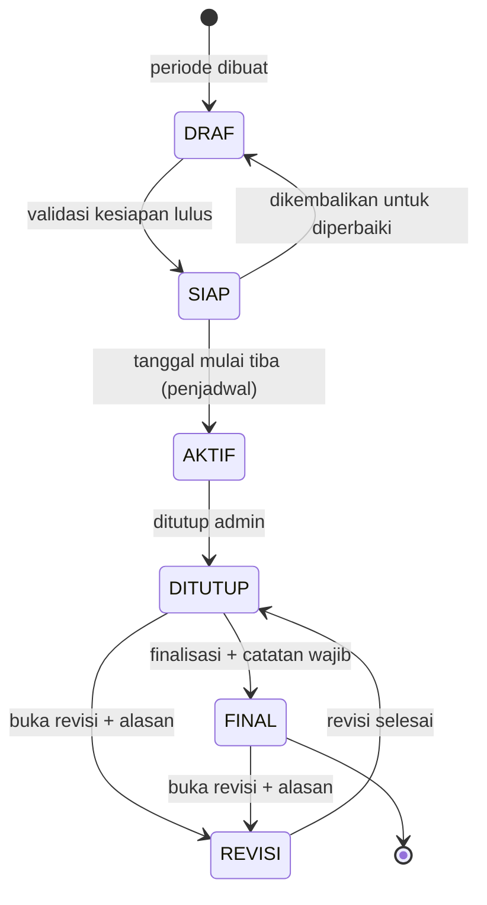
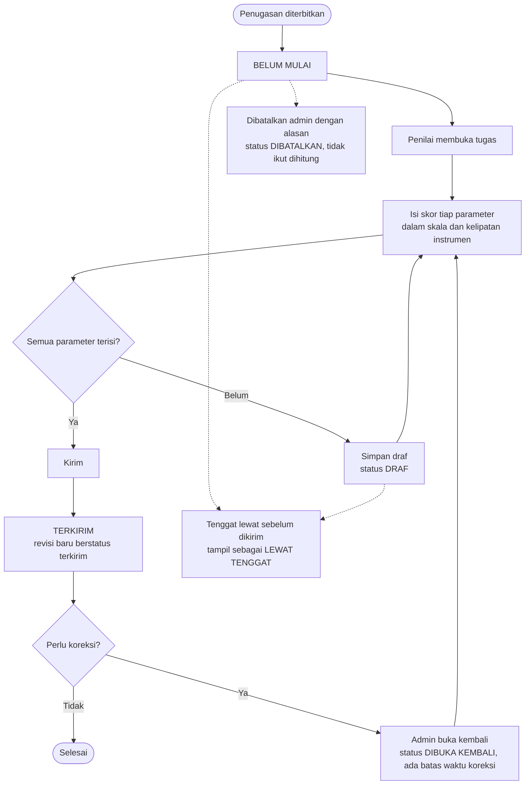
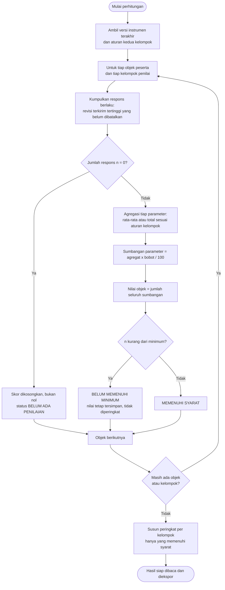
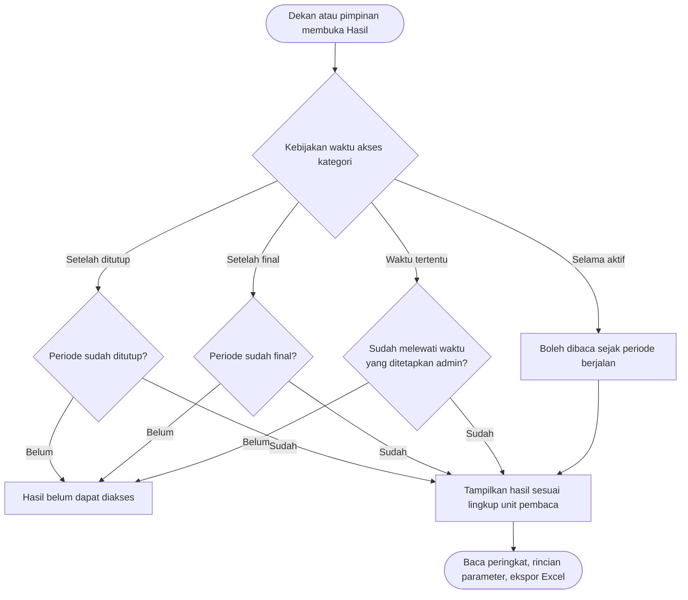

# Alur proses Survei Penilaian FSM UNDIP

Diagram aktivitas di bawah ini menggambarkan jalan yang ditempuh satu periode penilaian, dari data
master sampai hasil final. Semuanya mengikuti aturan yang benar-benar dijalankan kode di
`src/lib/services/` — status periode (`periods.ts`), pembagian penilai (`assignmentPlanning.ts`),
pengisian (`responses.ts`), perhitungan (`calculations.ts`), dan finalisasi (`finalization.ts`).

Empat pelaku muncul di seluruh dokumen:

| Pelaku | Perannya |
| --- | --- |
| **Admin** | Menyiapkan data, membuka dan menutup periode, menghitung dan memfinalkan hasil. |
| **Penjadwal** | Proses terjadwal di server; satu-satunya perpindahan status otomatis adalah Siap → Aktif. |
| **Penilai** | Siapa pun yang mendapat tugas penilaian, baik dari kelompok Pimpinan maupun Selain Pimpinan. |
| **Dekan / pimpinan** | Membaca hasil sesuai kebijakan waktu akses; tidak mengubah apa pun. |

## 1. Alur besar satu periode

```mermaid
flowchart TD
  subgraph ADMIN["Admin"]
    A1([Mulai]) --> A2[Siapkan data master:<br/>unit, pengguna, pimpinan, objek<br/>lewat Impor Excel atau isian manual]
    A2 --> A3[Buat periode baru<br/>status DRAF]
    A3 --> A4[Buat kategori penilaian<br/>pilih jenis objek]
    A4 --> A5[Pilih objek peserta kategori]
    A5 --> A6[Susun instrumen:<br/>parameter, bobot, skala, kelipatan skor]
    A6 --> A7[Tetapkan aturan dua kelompok:<br/>lingkup calon, target, minimum, metode agregasi]
    A7 --> A8[Pratinjau pembagian penilai]
    A8 --> A9{Kekurangan penilai<br/>bisa diterima?}
    A9 -- Tidak --> A10[Perluas lingkup atau<br/>turunkan target] --> A8
    A9 -- Ya --> A11[Terbitkan penugasan<br/>tugas dibuat: BELUM MULAI]
    A11 --> A12{Kategori lain?}
    A12 -- Ya --> A4
    A12 -- Tidak --> A13[Minta status SIAP]
    A13 --> A14{Validasi kesiapan lulus?<br/>bobot 100%, kedua kelompok diatur,<br/>objek punya penanggung jawab,<br/>penugasan sudah diterbitkan}
    A14 -- Belum --> A15[Perbaiki yang disebut<br/>daftar masalah] --> A13
    A14 -- Lulus --> A16[Periode SIAP]
  end

  subgraph SISTEM["Penjadwal"]
    S1[Tanggal mulai tiba] --> S2[Periode dibuka otomatis<br/>SIAP menjadi AKTIF]
  end

  subgraph PENILAI["Penilai"]
    P1[Tugas muncul di Tugas Saya] --> P2[Isi skor tiap parameter]
    P2 --> P3{Selesai?}
    P3 -- Belum --> P4[Simpan draf] --> P2
    P3 -- Ya --> P5[Kirim penilaian<br/>tugas menjadi TERKIRIM]
    P5 --> P6[Konfirmasi terkirim<br/>lanjut ke tugas berikutnya]
  end

  subgraph PANTAU["Admin selama periode aktif"]
    M1[Pantau kemajuan di Pemantauan] --> M2{Ada objek<br/>belum cukup dinilai?}
    M2 -- Ya --> M3[Tambah penilai atau objek<br/>wajib menyertakan alasan, tercatat di Audit] --> M1
    M2 -- Tidak --> M4[Biarkan berjalan sampai tenggat]
  end

  subgraph HASIL["Admin, lalu Dekan / pimpinan"]
    H1[Tutup periode<br/>AKTIF menjadi DITUTUP] --> H2[Hitung hasil per kategori]
    H2 --> H3[Peringkat per kelompok<br/>hanya objek yang memenuhi syarat]
    H3 --> H4[Hasil dibaca sesuai kebijakan waktu akses<br/>dan diekspor ke Excel]
    H4 --> H5{Hasil sudah benar?}
    H5 -- Belum --> H6[Buka revisi dengan alasan<br/>status REVISI] --> H7[Perbaiki respons atau instrumen] --> H1
    H5 -- Sudah --> H8[Finalisasi dengan catatan wajib<br/>status FINAL]
    H8 --> H9([Selesai])
  end

  A16 --> S1
  S2 --> P1
  S2 --> M1
  P5 --> M1
  M4 --> H1
```

## 2. Siklus hidup periode

Perpindahan status hanya boleh mengikuti panah di bawah; jalur lain ditolak oleh
`transitionPeriodStatus`. Menutup periode sengaja tidak diotomatiskan: penutupan tidak bisa
dibatalkan, jadi keputusannya tetap di tangan admin meski tenggat sudah lewat.

## 3. Satu tugas penilaian

Skor disimpan sebagai revisi: draf boleh ditulis ulang berkali-kali, dan yang dihitung selalu
revisi terkirim bernomor tertinggi yang belum dibatalkan. "Lewat tenggat" tidak pernah disimpan —
ia dihitung dari status tugas dan tenggat periode, supaya tidak ada nilai nol yang tersembunyi.

## 4. Perhitungan hasil satu kategori

Dijalankan ulang setiap kali ada perubahan respons, dan bisa dipicu manual dari halaman hasil.
Setiap eksekusi mematri versi instrumen dan aturan kelompok yang dipakai, jadi hasil lama tetap
dapat direproduksi walau instrumennya kemudian direvisi.

## 5. Siapa boleh melihat hasil

Waktu akses diatur per kategori dan hanya mengikat pembaca non-admin.

